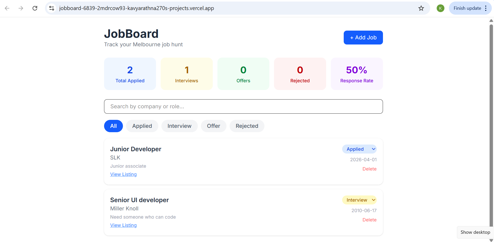
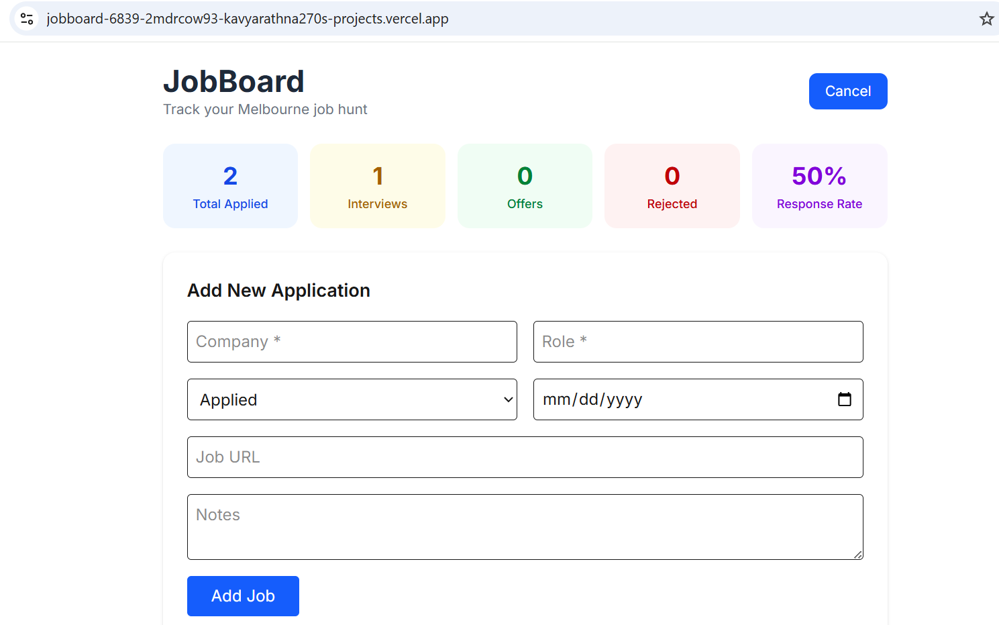

# JobBoard

A full-stack job application tracker built to solve a real problem —
managing the chaos of a job search in one clean interface.

🔗 *Live App:* [Job Board](https://jobboard-6839-2mdrcow93-kavyarathna270s-projects.vercel.app/)

---

## Features

- Add and track job applications with status, date, notes and URL
- Dashboard with live stats: total applied, interviews, offers, response rate
- Filter by status, search by company or role
- Inline status updates and delete
- Fully responsive UI

---

## Tech Stack

| Layer | Technology |
|---|---|
| Frontend | Next.js 14 (App Router), TypeScript, Tailwind CSS |
| Backend | Next.js API Routes |
| Database | PostgreSQL via Supabase |
| Auth | Row Level Security (Supabase) |
| Testing | Jest + React Testing Library |
| CI/CD | GitHub Actions |
| Deployment | Vercel |

---

## Architecture Decisions

*Why Next.js API Routes instead of a separate Express server?*
For a project of this scope, co-locating API routes with the frontend
reduces deployment complexity and cold start times on Vercel.
A separate Node server would be the right call if the backend needed
to scale independently or serve multiple clients.

*Why Supabase instead of raw PostgreSQL?*
Supabase gives Row Level Security out of the box, meaning database-level
access control without writing middleware. It also removes the overhead
of managing a database server for a portfolio project.

*Why server components for the layout, client components for interactive UI?*
Next.js 14's App Router allows layouts and static shells to be server-rendered
for faster initial load, while interactive components (forms, filters, dropdowns)
opt into client-side rendering only where needed.

---

## Running Locally

1. Clone the repo
2. Install dependencies: npm install
3. Create .env.local with your Supabase credentials:
NEXT_PUBLIC_SUPABASE_URL=your_url
NEXT_PUBLIC_SUPABASE_ANON_KEY=your_key
4. Run: npm run dev
5. Open: http://localhost:3000

---

## What I'd Add Next

- Google OAuth login so each user has private data
- Email reminders for follow-ups
- Charts showing application trends over time
- Export to CSV

## Screenshots

